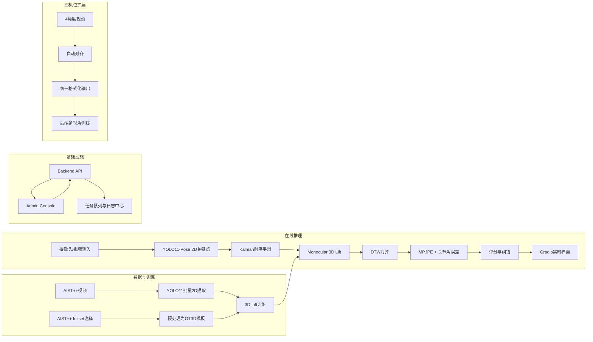

# PoseMentor（AIST++ 单摄像头动作教学系统）

当前阶段聚焦：
- 单摄像头实时输入
- 实时打分（0-100）
- 错误关节红绿高亮
- 语音纠错
- 本地化运行

并且已具备：
- 后台任务编排（Backend API）
- 管理前端（Admin Console）
- 四机位数据对齐与格式化管线（为后续训练扩展预留）
- 模型批量测试与报告

---

## 1. 总体架构（快速路径 + 扩展路径）



---

## 2. 目录结构

```text
posementor/
├── app_demo.py
├── backend_api.py
├── admin_console.py
├── download_and_prepare_aist.py
├── extract_pose_yolo11.py
├── train_3d_lift_demo.py
├── inference_pipeline_demo.py
├── evaluate_model_suite.py
├── prepare_multiview_dataset.py
├── pyproject.toml
├── configs/
│   ├── data.yaml
│   ├── train.yaml
│   ├── infer.yaml
│   └── multiview.yaml
├── scripts/
│   ├── launch_macos.sh
│   └── launch_windows.ps1
├── docker/
│   ├── Dockerfile
│   └── docker-compose.yml
├── docs/
│   ├── QUICKSTART.md
│   └── TROUBLESHOOTING.md
├── src/posementor/
│   ├── data/
│   ├── models/
│   ├── pipeline/
│   ├── multiview/
│   ├── infra/
│   └── utils/
└── tests/
```

---

## 3. 一键部署命令（macOS / Windows）

### macOS

```bash
cd /Users/mac/WorkSpace/Python_Project/posementor
./scripts/launch_macos.sh all
```

### Windows

```powershell
cd C:\path\to\posementor
powershell -ExecutionPolicy Bypass -File .\scripts\launch_windows.ps1 -Action all
```

启动后默认入口：
- 在线系统：`http://127.0.0.1:7860`
- 管理后台：`http://127.0.0.1:7861`
- Backend API：`http://127.0.0.1:8787`

停止服务：
- macOS：`./scripts/launch_macos.sh stop`
- Windows：`powershell -ExecutionPolicy Bypass -File .\scripts\launch_windows.ps1 -Action stop`

---

## 4. AIST++ 一键数据准备

官方链接：
- 注释包：[fullset.zip](https://storage.googleapis.com/aist_plusplus_public/20210308/fullset.zip)
- 视频清单：[video_list.txt](https://storage.googleapis.com/aist_plusplus_public/20121228/video_list.txt)
- 视频源前缀：<https://aistdancedb.ongaaccel.jp/v1.0.0/video/10M>

### 4.1 下载注释并解压 + 预处理

```bash
uv run python download_and_prepare_aist.py --config configs/data.yaml --download --extract
```

### 4.2 下载视频（先设上限）

```bash
uv run python download_and_prepare_aist.py \
  --config configs/data.yaml \
  --download-videos \
  --video-limit 120 \
  --agree-aist-license \
  --skip-preprocess
```

### 4.3 提取 2D 关键点

```bash
uv run python extract_pose_yolo11.py --weights yolo11m-pose.pt --config configs/data.yaml
```

---

## 5. 训练与推理

### 5.1 训练 3D Lift

```bash
uv run python train_3d_lift_demo.py --config configs/train.yaml --export-onnx
```

输出：
- `artifacts/lift_demo.ckpt`
- `artifacts/lift_demo_norm.npz`
- `artifacts/lift_demo.onnx`

### 5.2 实时界面

```bash
uv run python app_demo.py --yolo-weights yolo11m-pose.pt
```

### 5.3 命令行推理

```bash
uv run python inference_pipeline_demo.py --source webcam --show --style gBR
```

---

## 6. 四机位处理（扩展）

输入目录约定：

```text
data/raw/multiview/
  session_001/
    front.mp4
    left.mp4
    right.mp4
    back.mp4
```

运行：

```bash
uv run python prepare_multiview_dataset.py --config configs/multiview.yaml --limit-sessions 20
```

输出：
- `data/processed/multiview/<session>/session_meta.json`
- `data/processed/multiview/multiview_manifest.csv`

---

## 7. 模型测试与报告

```bash
uv run python evaluate_model_suite.py \
  --input-dir data/raw/aistpp/videos \
  --style gBR \
  --max-videos 20 \
  --output-csv outputs/eval/summary.csv
```

---

## 8. 后台 API 与任务中心

核心接口：
- `GET /health`
- `GET /jobs`
- `GET /jobs/{job_id}`
- `GET /jobs/{job_id}/log`
- `POST /jobs/data/prepare`
- `POST /jobs/pose/extract`
- `POST /jobs/train`
- `POST /jobs/multiview/prepare`
- `POST /jobs/evaluate`

任务日志默认输出：
- `outputs/job_center/jobs.json`
- `outputs/job_center/logs/*.log`

---

## 9. Docker

```bash
cd docker
docker compose up --build
```

容器服务：
- `backend-api`（8787）
- `admin-console`（7861）
- `posementor-app`（7860）
