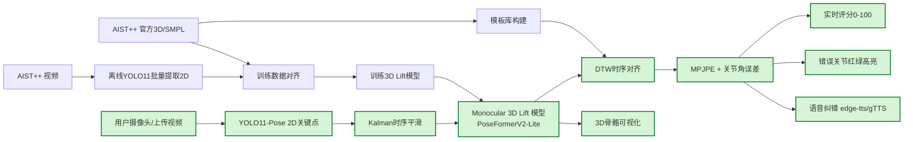

# PoseMentor（AIST++ 快速 Demo）

> 目标：2-3 天内做出“单摄像头输入 -> 实时打分 + 错误关节高亮 + 语音纠错”的最小可演示系统。  
> 当前阶段 **仅使用 AIST++**，不引入四机位自采数据。

## 1. 项目整体架构图（含“快速 Demo 路径”）



绿色节点即“快速 Demo 路径”。

---

## 2. 目录结构

```text
posementor/
├── app_demo.py
├── download_and_prepare_aist.py
├── extract_pose_yolo11.py
├── inference_pipeline_demo.py
├── train_3d_lift_demo.py
├── pyproject.toml
├── README.md
├── configs/
│   ├── data.yaml
│   ├── infer.yaml
│   └── train.yaml
├── docs/
│   ├── QUICKSTART.md
│   └── TROUBLESHOOTING.md
├── docker/
│   ├── Dockerfile
│   └── docker-compose.yml
├── src/posementor/
│   ├── __init__.py
│   ├── settings.py
│   ├── data/
│   │   ├── __init__.py
│   │   ├── aist_dataset.py
│   │   └── aist_loader.py
│   ├── models/
│   │   ├── __init__.py
│   │   └── lift_net.py
│   ├── pipeline/
│   │   ├── __init__.py
│   │   └── realtime_coach.py
│   └── utils/
│       ├── __init__.py
│       ├── io.py
│       ├── joints.py
│       ├── kalman.py
│       ├── math3d.py
│       ├── scoring.py
│       ├── tts.py
│       └── visualize.py
├── artifacts/
├── data/
│   ├── raw/
│   └── processed/
└── outputs/
```

---

## 3. 从零开始运行（uv + Windows/macOS 分离）

### 3.1 Python 与 uv

```bash
# 安装 uv（任选其一）
curl -LsSf https://astral.sh/uv/install.sh | sh
# 或 brew install uv
```

### 3.2 创建环境并安装依赖

#### macOS（Apple Silicon / Intel）

```bash
cd /Users/mac/WorkSpace/Python_Project/posementor
uv sync --group dev --group mac
```

#### Windows（建议 NVIDIA GPU）

```powershell
cd C:\path\to\posementor
uv sync --group dev --group windows
```

> 如果你希望 Windows 使用 CUDA 版 PyTorch，请按你的 CUDA 版本执行官方安装命令后再 `uv sync`。

### 3.3 准备 AIST++ 数据（含一键下载）

官方数据入口（可直接访问）：

- 注释全量包（fullset，含 keypoints/SMPL/splits）：[fullset.zip](https://storage.googleapis.com/aist_plusplus_public/20210308/fullset.zip)
- 视频清单（10M）：[video_list.txt](https://storage.googleapis.com/aist_plusplus_public/20121228/video_list.txt)
- 视频源前缀：<https://aistdancedb.ongaaccel.jp/v1.0.0/video/10M>

一键下载并预处理注释（默认使用 `configs/data.yaml` 内置链接）：

```bash
uv run python download_and_prepare_aist.py --config configs/data.yaml --download --extract
```

按官方视频列表下载（示例：先下 120 段），需要先确认你已同意 AIST++ 许可：

```bash
uv run python download_and_prepare_aist.py \
  --config configs/data.yaml \
  --download-videos \
  --video-limit 120 \
  --agree-aist-license \
  --skip-preprocess
```

完成后目录结构如下：

```text
data/raw/aistpp/
  ├── annotations/
  └── videos/
```

YOLO11 批量提取 2D 关键点：

```bash
uv run python extract_pose_yolo11.py --weights yolo11m-pose.pt --config configs/data.yaml
```

### 3.4 训练 3D lift 模型

```bash
uv run python train_3d_lift_demo.py --config configs/train.yaml --export-onnx
```

产物默认输出：

- `artifacts/lift_demo.ckpt`
- `artifacts/lift_demo_norm.npz`
- `artifacts/lift_demo.onnx`

### 3.5 启动 Demo

#### Gradio 全功能 Demo（实时输入 + 视频输入）

```bash
uv run python app_demo.py --yolo-weights yolo11m-pose.pt
```

浏览器打开：`http://127.0.0.1:7860`

#### CLI 推理测试

```bash
uv run python inference_pipeline_demo.py --source webcam --show --style gBR
```

---

## 4. 快速 Demo 指标建议

- 目标精度（Demo）：MPJPE < 30mm、角度误差 < 10°
- 目标实时性（Demo）：RTX 4060 及以上可达 25 FPS+（640~720p）
- 当前评分是可解释线性融合，适合快速验证阶段

---

## 5. Docker 预留方案（后续部署）

已提供：

- `docker/Dockerfile`
- `docker/docker-compose.yml`

先本地验证 Demo，再进入容器化部署。

---

## 6. 已知边界

- AIST++ 文件命名/字段在不同下载方式下可能略有差异，`aist_loader.py` 已做字段候选兼容。
- `edge-tts`/`gTTS` 需要网络可用，若离线环境可后续换成本地 TTS 引擎。
- 目前默认 COCO-17 关节；若后续使用 SMPL 全关节，请补充精确映射矩阵。
