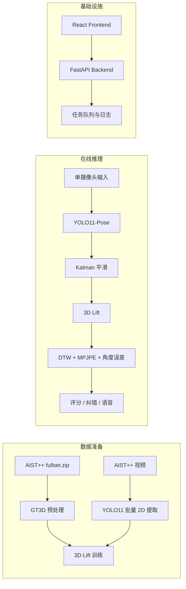

# PoseMentor

AIST++ 单摄像头动作教学系统（本地运行）。

当前主链路：
- 数据集：仅使用 AIST++
- 输入：摄像头 / 单视频
- 输出：实时评分、错误关节提示、语音反馈
- 推理链路：YOLO11-Pose -> 3D Lift -> DTW 对齐与评分

前端正在 `frontend/` 目录持续重构，后端和训练管线保持可用。

## 架构总览



## 目录结构

```text
posementor/
├── backend_api.py
├── download_and_prepare_aist.py
├── extract_pose_yolo11.py
├── train_3d_lift_demo.py
├── inference_pipeline_demo.py
├── evaluate_model_suite.py
├── prepare_multiview_dataset.py
├── configs/
├── docs/
├── frontend/
├── src/posementor/
├── tests/
└── docker/
```

## 快速开始

完整步骤见：[`docs/QUICKSTART.md`](docs/QUICKSTART.md)

最短路径（macOS）：

```bash
uv sync --group dev --group mac
uv run python download_and_prepare_aist.py --config configs/data.yaml --download --extract
uv run python train_3d_lift_demo.py --config configs/train.yaml --export-onnx
uv run python backend_api.py
```

新开终端启动前端：

```bash
cd frontend
pnpm install
pnpm dev --host 127.0.0.1 --port 7860
```

## AIST++ 下载链接

- 注释包：[fullset.zip](https://storage.googleapis.com/aist_plusplus_public/20210308/fullset.zip)
- 视频清单：[video_list.txt](https://storage.googleapis.com/aist_plusplus_public/20121228/video_list.txt)
- 视频源前缀：[10M 视频目录](https://aistdancedb.ongaaccel.jp/v1.0.0/video/10M)

一键注释下载 + 解压 + 预处理：

```bash
uv run python download_and_prepare_aist.py --config configs/data.yaml --download --extract
```

## 常用命令

提取 2D 关键点：

```bash
uv run python extract_pose_yolo11.py --weights yolo11m-pose.pt --config configs/data.yaml
```

训练 3D Lift：

```bash
uv run python train_3d_lift_demo.py --config configs/train.yaml --export-onnx
```

命令行推理：

```bash
uv run python inference_pipeline_demo.py --source webcam --show --style gBR
```

离线评测：

```bash
uv run python evaluate_model_suite.py --input-dir data/raw/aistpp/videos --style gBR --max-videos 20 --output-csv outputs/eval/summary.csv
```

四机位预处理（扩展）：

```bash
uv run python prepare_multiview_dataset.py --config configs/multiview.yaml --limit-sessions 20
```

## Backend API

默认地址：`http://127.0.0.1:8787`

- 健康检查：`GET /health`、`GET /api/health`
- 任务列表：`GET /jobs`
- 任务详情：`GET /jobs/{job_id}`
- 日志读取：`GET /jobs/{job_id}/log`
- 数据任务：`POST /jobs/data/prepare`
- 提取任务：`POST /jobs/pose/extract`
- 训练任务：`POST /jobs/train`
- 多机位任务：`POST /jobs/multiview/prepare`
- 评测任务：`POST /jobs/evaluate`

任务文件：
- `outputs/job_center/jobs.json`
- `outputs/job_center/logs/*.log`

## 其他文档

- 快速执行：[`docs/QUICKSTART.md`](docs/QUICKSTART.md)
- 排障手册：[`docs/TROUBLESHOOTING.md`](docs/TROUBLESHOOTING.md)
- 基础设施：[`docs/INFRA.md`](docs/INFRA.md)
