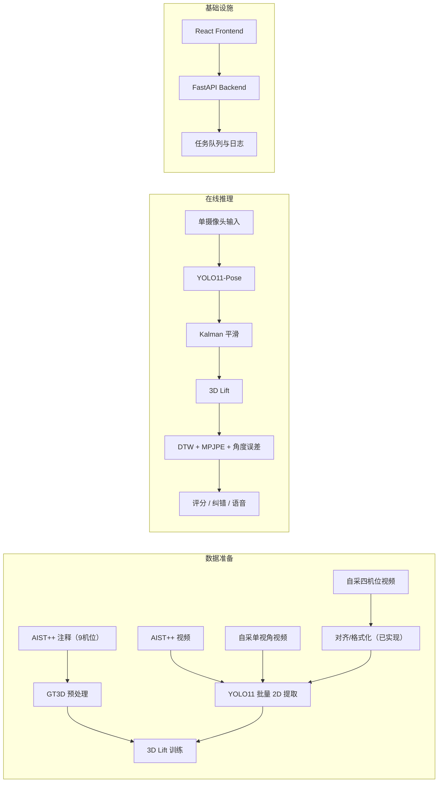

# 姿态教练 PoseMentor

基于 AI 单摄像头实时姿态评估与纠错的舞蹈体育教学系统。

当前主链路：
- 数据集：AIST++（默认）+ 自定义数据集扩展位
- 输入：摄像头 / 单视频
- 输出：实时评分、错误关节提示、语音反馈
- 推理链路：YOLO11-Pose -> 3D Lift -> DTW 对齐与评分
- 训练可视化：按 epoch 自动生成 HTML 曲线

前端正在 `frontend/` 目录持续重构，后端和训练管线保持可用。

## 架构总览



## 目录结构

```text
posementor/
├── backend_api.py
├── download_and_prepare_aist.py
├── extract_pose_yolo11.py
├── train_3d_lift_demo.py
├── inference_pipeline_demo.py
├── evaluate_model_suite.py
├── prepare_multiview_dataset.py
├── configs/
├── docs/
├── frontend/
├── src/posementor/
├── tests/
└── docker/
```

## 快速开始

完整步骤见：[`docs/QUICKSTART.md`](docs/QUICKSTART.md)

快速路径（推荐）：

```bash
uv run python scripts/config_setup.py
uv run posementor init
uv run posementor quickstart --epochs 1 --export-onnx --up
```

也支持项目内可执行入口（完成 `init` 后）：

```bash
./posementor config
./posementor doctor
./posementor quickstart --epochs 1 --up
```

Windows 会在 `init` 后生成 `posementor.exe`，可直接：

```powershell
posementor.exe config
posementor.exe doctor
posementor.exe quickstart --epochs 1 --up
```

查看状态与日志：
- `uv run posementor status`
- `uv run posementor logs --service all --lines 120`

## AIST++ 下载链接

- 注释包：[fullset.zip](https://storage.googleapis.com/aist_plusplus_public/20210308/fullset.zip)
- 视频清单：[video_list.txt](https://storage.googleapis.com/aist_plusplus_public/20121228/video_list.txt)
- 视频源前缀：[10M 视频目录](https://aistdancedb.ongaaccel.jp/v1.0.0/video/10M)

一键注释下载 + 解压 + 预处理：

```bash
uv run python download_and_prepare_aist.py --config configs/data.yaml --download --extract
```

快速构建训练用 2D（无需先跑 YOLO）：

```bash
uv run python extract_pose_aist2d.py --config configs/data.yaml
```

可用数据集清单（后端注册表）：

```bash
curl http://127.0.0.1:8787/datasets
```

## 常用命令

提取 2D 关键点：

```bash
uv run python extract_pose_yolo11.py --weights yolo11m-pose.pt --config configs/data.yaml
```

训练 3D Lift：

```bash
uv run python train_3d_lift_demo.py --config configs/train.yaml --export-onnx
```

训练完成后可视化输出：
- `artifacts/visualizations/training_curves.html`
- `artifacts/visualizations/training_history.csv`
- `artifacts/visualizations/samples/sample_2d_latest.png`
- `artifacts/visualizations/samples/sample_3d_latest.html`

## 训练产物说明

训练后核心产物有 3 类：

- `artifacts/lift_demo.ckpt`：PyTorch/Lightning 权重（主推理权重）
- `artifacts/lift_demo_norm.npz`：2D 归一化参数（训练/推理必须一致）
- `artifacts/lift_demo.onnx`（可选）：部署版模型（ONNX Runtime / TensorRT）
- `artifacts/visualizations/samples/sample_video_latest.mp4`：素材同步片段
- `artifacts/visualizations/samples/sample_2d_latest.mp4`：2D 骨架同步片段
- `artifacts/visualizations/samples/sample_3d_latest.mp4`：3D 骨架同步片段

这个模型做的事：
- 输入单摄像头 2D 关键点序列
- 输出每一帧 3D 关节点轨迹
- 供后续 DTW、MPJPE、角度误差打分模块使用

最小使用方式：

```bash
uv run python inference_pipeline_demo.py --source webcam --show --style gBR
```

命令行推理：

```bash
uv run python inference_pipeline_demo.py --source webcam --show --style gBR
```

离线评测：

```bash
uv run python evaluate_model_suite.py --input-dir data/raw/aistpp/videos --style gBR --max-videos 20 --output-csv outputs/eval/summary.csv
```

四机位预处理（扩展）：

```bash
uv run python prepare_multiview_dataset.py --config configs/multiview.yaml --limit-sessions 20
```

四机位视频同样可走 YOLO2D 提取链路（递归模式）：

```bash
uv run python extract_pose_yolo11.py --config configs/data.yaml --video-root data/processed/multiview --out-dir data/processed/multiview_pose2d --recursive --weights yolo11m-pose.pt
```

四机位处理报告：

```bash
uv run python visualize_multiview_report.py --manifest data/processed/multiview/multiview_manifest.csv
```

## CLI 集成

统一入口命令：`posementor`（兼容入口脚本：`posementor_cli.py`）

示例：

```bash
uv run posementor config --force
uv run posementor doctor
uv run posementor install-launchers
uv run posementor up
uv run posementor status
uv run posementor cleanup
uv run posementor logs --service backend_api --lines 80
uv run posementor down

./posementor status
./posementor cleanup
./posementor logs --service all --lines 120

uv run python posementor_cli.py extract-aist2d --config configs/data.yaml
uv run python posementor_cli.py train-lift --config configs/train.yaml --epochs 2
uv run python posementor_cli.py prepare-multiview --config configs/multiview.yaml --limit-sessions 10
```

## Backend API

默认地址：`http://127.0.0.1:8787`

- 健康检查：`GET /health`、`GET /api/health`
- 数据集注册：`GET /datasets`、`GET /api/datasets`
- 标准库注册：`GET /standards`、`GET /api/standards`
- 素材预览：`GET /workspace/source-preview`、`GET /api/workspace/source-preview`
- 任务列表：`GET /jobs`
- 任务详情：`GET /jobs/{job_id}`
- 日志读取：`GET /jobs/{job_id}/log`
- 产物状态：`GET /artifacts/status`、`GET /api/artifacts/status`
- 产物清单：`GET /artifacts/manifest`、`GET /api/artifacts/manifest`
- 数据任务：`POST /jobs/data/prepare`
- 提取任务：`POST /jobs/pose/extract`
- 训练任务：`POST /jobs/train`
- 多机位任务：`POST /jobs/multiview/prepare`
- 评测任务：`POST /jobs/evaluate`

任务文件：
- `outputs/job_center/jobs.json`
- `outputs/job_center/logs/*.log`

## 前后端边界

- 前端（`frontend/`）：页面、交互、可视化、任务管理视图
- 后端（`backend_api.py` + `src/posementor/`）：数据处理、训练调度、推理和任务状态

前端只通过 HTTP API 调后端，不直接访问训练脚本。

## 其他文档

- 快速执行：[`docs/QUICKSTART.md`](docs/QUICKSTART.md)
- 排障手册：[`docs/TROUBLESHOOTING.md`](docs/TROUBLESHOOTING.md)
- 基础设施：[`docs/INFRA.md`](docs/INFRA.md)
- 模型产物：[`docs/MODEL_ARTIFACTS.md`](docs/MODEL_ARTIFACTS.md)
- 训练框架：[`docs/TRAINING_PIPELINE.md`](docs/TRAINING_PIPELINE.md)
- 数据规格与采集：[`docs/DATASET_CAPTURE_GUIDE.md`](docs/DATASET_CAPTURE_GUIDE.md)
