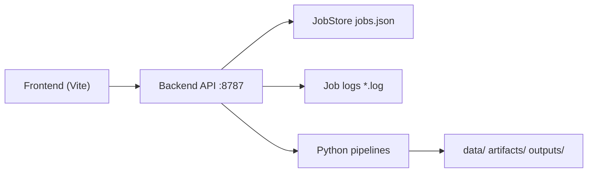

# Infra

## 1. 组件

- `backend_api.py`：FastAPI 任务编排入口
- `src/posementor/infra/job_store.py`：任务状态持久化
- `src/posementor/infra/command_runner.py`：子进程任务执行与日志采集
- `frontend/`：React 管理与演示前端（重构中）
- `posementor_cli.py`：统一 CLI 入口
- `scripts/launch_macos.sh` / `scripts/launch_windows.ps1`：本地一键启动脚本

## 2. 运行拓扑



## 3. 后端接口

基础路由：
- `GET /`
- `GET /health`
- `GET /api`
- `GET /api/health`

任务路由：
- `GET /jobs`
- `GET /jobs/{job_id}`
- `GET /jobs/{job_id}/log`
- `POST /jobs/data/prepare`
- `POST /jobs/pose/extract`
- `POST /jobs/train`
- `POST /jobs/multiview/prepare`
- `POST /jobs/evaluate`

## 4. 存储与日志

- 任务状态：`outputs/job_center/jobs.json`
- 任务日志：`outputs/job_center/logs/<job_id>.log`

建议：
- 将 `outputs/job_center` 挂载到持久化盘
- 保留日志至少 7 天，便于回溯训练与数据任务

## 5. 进程建议

本地开发建议两端分开启动：

后端：

```bash
uv run python backend_api.py
```

前端：

```bash
cd frontend
pnpm dev --host 127.0.0.1 --port 7860
```

也可使用一键脚本：

- macOS：`./scripts/launch_macos.sh all`
- Windows：`powershell -ExecutionPolicy Bypass -File .\scripts\launch_windows.ps1 -Action all`

## 6. Docker 说明

`docker/` 目录保留了基础 Python 容器配置，当前前端重构阶段建议先用本地方式开发与联调。

前端稳定后可按以下结构拆分容器：
- `backend-api`：FastAPI + 任务执行
- `frontend`：静态资源服务或 Node runtime
- `worker`（可选）：独立训练/评测执行进程
