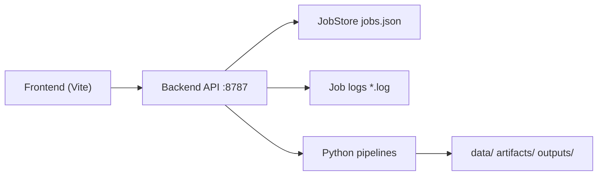

# Infra

## 1. 组件

- `backend_api.py`：FastAPI 任务编排入口（后端边界）
- `src/posementor/infra/job_store.py`：任务状态持久化
- `src/posementor/infra/command_runner.py`：子进程任务执行与日志采集
- `frontend/`：React 管理与演示前端（前端边界）
- `posementor_cli.py`：统一 CLI 入口
- `scripts/launch_macos.sh` / `scripts/launch_windows.ps1`：本地一键启动脚本
- `configs/datasets.yaml`：数据集注册表（AIST++ / 自定义数据源扩展位）
- `configs/standards.yaml`：评分标准库注册表（业务标准动作模板版本）
- `configs/local.yaml`：本地运行配置（端口、默认数据集、日志目录）

## 2. 运行拓扑



## 3. 后端接口

基础路由：
- `GET /`
- `GET /health`
- `GET /api`
- `GET /api/health`
- `GET /datasets`
- `GET /api/datasets`
- `GET /standards`
- `GET /api/standards`
- `GET /workspace/source-preview`
- `GET /api/workspace/source-preview`
- `GET /artifacts/status`
- `GET /api/artifacts/status`
- `GET /artifacts/manifest`
- `GET /api/artifacts/manifest`

任务路由：
- `GET /jobs`
- `GET /jobs/{job_id}`
- `GET /jobs/{job_id}/log`
- `POST /jobs/data/prepare`
- `POST /jobs/pose/extract`
- `POST /jobs/train`
- `POST /jobs/multiview/prepare`
- `POST /jobs/evaluate`

## 4. 存储与日志

- 任务状态：`outputs/job_center/jobs.json`
- 任务日志：`outputs/job_center/logs/<job_id>.log`

建议：
- 将 `outputs/job_center` 挂载到持久化盘
- 保留日志至少 7 天，便于回溯训练与数据任务

## 5. 进程建议

本地开发建议两端分开启动：

后端：

```bash
uv run python backend_api.py
```

前端：

```bash
cd frontend
pnpm dev --host 127.0.0.1 --port 7860
```

也可使用一键脚本：

- macOS：`./scripts/launch_macos.sh all`
- Windows：`powershell -ExecutionPolicy Bypass -File .\scripts\launch_windows.ps1 -Action all`

也可使用 CLI 控制：

- `uv run posementor config`
- `uv run posementor init`
- `uv run posementor install-launchers`
- `uv run posementor up`
- `uv run posementor status`
- `uv run posementor logs --service all --lines 120`
- `uv run posementor down`

可执行入口：
- macOS/Linux：`./posementor ...`
- Windows：`posementor.exe ...`（执行 `init` 后自动生成）

## 6. Docker 说明

`docker/` 目录保留了基础 Python 容器配置，当前前端重构阶段建议先用本地方式开发与联调。

前端稳定后可按以下结构拆分容器：
- `backend-api`：FastAPI + 任务执行
- `frontend`：Node + Vite 开发服务（当前 compose 已接入）
- `worker`（可选）：独立训练/评测执行进程

当前可直接运行：

```bash
cd docker
docker compose up --build
```

## 7. 扩展位说明

- 数据源扩展：在 `configs/datasets.yaml` 注册 `dataset_id`
- 2D 提取扩展：`extract_pose_yolo11.py` 支持 `--video-root`、`--out-dir`、`--recursive`
- 训练扩展：`train_3d_lift_demo.py` 支持 `--yolo2d-dir`、`--gt3d-dir`、`--artifact-dir`
