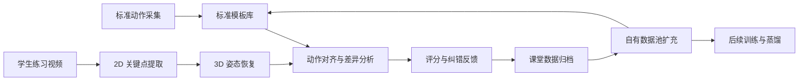

# 技术路线与一期建设方案

## 1. 文档目的

本文档用于统一项目的一期建设目标、技术路线和数据策略。
当前阶段的目标不是追求极致实时性能，而是先做出一个可落地、可解释、可持续积累数据的教学平台。

## 2. 一期目标

一期系统聚焦一个明确场景：

- 教师可以指定一个标准动作模板
- 学生可以上传或采集动作视频
- 系统能够完成动作对齐、差异对比、评分与问题提示
- 教学过程中的原始视频、关键点、评分结果能够持续沉淀，形成自有数据资产

一期交付物应首先服务教学，不以公开 benchmark 分数或多人实时演示为核心目标。

## 3. 项目定位

本项目的核心不是通用姿态识别，而是面向舞蹈与体育教学的标准动作比对平台。

系统最终要解决的问题是：

- 如何定义一个可复用的标准动作模板
- 如何把学生动作与标准模板进行可解释的差异对比
- 如何把对比结果转化为教师可用、学生可理解的反馈
- 如何在日常教学中持续积累更高质量的自有数据

因此，项目的技术主线应围绕`标准模板库`与`教学数据闭环`展开，而不是先围绕大规模训练和高并发推理展开。

## 4. 建设原则

### 4.1 先做标准模板平台，再做高性能系统

当前阶段优先完成：

- 标准动作模板管理
- 动作对齐与差异分析
- 评分与纠错展示
- 数据沉淀与归档

后续阶段再提升：

- 推理速度
- 多人能力
- 更高精度的 3D 重建
- 更复杂的课堂实时互动

### 4.2 自有数据是核心资产

公开数据集可以提供基础能力，但不能直接定义学校自己的教学标准。

公开数据的作用是：

- 验证训练流程是否可用
- 提供基础姿态表示能力
- 用于预训练、蒸馏或鲁棒性补充

自有数据的作用是：

- 定义标准动作模板
- 定义评分规则与纠错逻辑
- 覆盖具体舞种、民族特色动作、长时序动作与专业教学要求

因此，一期系统必须支持在教学过程中持续沉淀自有数据，而不是只围绕公开数据集工作。

### 4.3 先保证可解释，再追求端到端

一期评分应优先采用可解释路线：

- 时间对齐
- 关键帧差异
- 关节角度差异
- 轨迹差异
- 节奏差异
- 分部位评分

这种路线更适合教学场景，也更利于教师接受与后期迭代。

## 5. 一期系统形态

一期系统建议定位为“标准模板指定与差异对比教学平台”。

### 5.1 平台输入

平台输入包括两类：

- 标准模板素材
- 学生练习素材

其中标准模板素材优先来自：

- 教师示范视频
- 经过筛选的自有高质量多机位采集
- 必要时辅以公开数据的基础能力结果

学生练习素材可以来自：

- 单摄像头课堂采集
- 本地上传视频
- 后续接入移动端或教室采集设备

### 5.2 平台输出

平台输出至少包括：

- 标准模板与学生动作的同步对比
- 2D 骨架与 3D 骨架可视化
- 总分与分项得分
- 关键偏差点说明
- 结果归档与可追溯记录

### 5.3 平台核心能力

一期需要稳定实现以下能力：

1. 选择标准模板
2. 选择待评估动作
3. 完成动作时间对齐
4. 输出关键点和骨架差异
5. 输出评分与问题说明
6. 归档本次对比结果
7. 将教学过程数据沉淀到数据池

## 6. 技术路线

## 6.1 总体路线

建议采用“模板驱动 + 数据闭环”的技术路线：

这条路线的重点不是一次性把模型做满，而是先把数据、模板和反馈闭环建立起来。

## 6.2 标准模板库

标准模板库不是简单的模型文件集合，而是动作标准的结构化表达。

每个标准模板建议至少包含：

- 动作名称与类别
- 对应的标准视频片段
- 2D 关键点序列
- 3D 骨架序列
- 动作分段信息
- 关键帧定义
- 关键关节角度范围
- 节奏与时长信息
- 评分权重配置
- 模板版本号与来源说明

这意味着一期系统要建设的是模板管理能力，而不仅是模型推理能力。

## 6.3 差异对比引擎

差异对比引擎是一期开发表现价值的核心。

建议先采用以下组合：

- 时序对齐：DTW 或等价时序对齐方法
- 空间对齐：骨架归一化与根节点对齐
- 结构差异：关键关节位置与骨段方向对比
- 角度差异：肩、肘、髋、膝等关键角度对比
- 节奏差异：动作快慢、停顿与转折时刻对比

最终输出应尽量接近教学语言，例如：

- 起势提前
- 左臂抬得不够
- 躯干前倾过多
- 落脚节奏偏慢

## 6.4 模型路线

一期模型路线建议采用“基础能力复用 + 自有规则主导”的思路。

### 基础能力层

- 2D 姿态估计
- 时序平滑
- 3D lifting

### 教学决策层

- 模板对齐
- 差异分析
- 评分规则
- 教学反馈生成

公开模型与公开数据适合放在基础能力层。
教学价值主要来自教学决策层，而这一层必须由自有数据和教师规则逐步建立。

### 蒸馏策略定位

如果后续引入蒸馏，建议目标明确：

- 用更强模型提升 2D 或 3D 基础表示能力
- 用于压缩推理成本
- 用于提升低质量课堂视频的鲁棒性

蒸馏不能替代标准模板库建设，也不能替代教学规则本身。

## 6.5 数据闭环路线

教学平台的长期价值来自数据闭环，而不是一次训练。

建议把数据分为三层：

### 标准模板集

特点：

- 质量高
- 标签清晰
- 来源稳定
- 数量可控

用途：

- 生成标准动作模板
- 标定评分基线
- 做系统演示与核心验证

### 教学原料池

特点：

- 数量大
- 来源广
- 质量不完全统一
- 包含学生真实练习情况

用途：

- 提升模型鲁棒性
- 补充动作覆盖范围
- 发现常见错误模式
- 为后续蒸馏和训练提供原料

### 评测集

特点：

- 数量小
- 标签最稳定
- 不参与训练

用途：

- 评估版本迭代是否真正提升
- 防止系统只对局部数据有效

## 7. 一期边界

为了保证落地效率，一期建议明确边界。

### 一期优先做

- 单人动作评估
- 标准模板指定
- 标准模板与学生动作差异对比
- 评分与纠错说明
- 训练工作台与可视化过程
- 数据入库、归档与版本管理基础能力

### 一期暂不作为重点

- 多人实时课堂追踪
- 超低延迟推理
- 复杂 avatar 重定向
- 大规模云端分布式训练
- 完全端到端自动评分模型

这不是放弃，而是阶段性排序。

## 8. 公开数据与自有数据的关系

公开数据不能直接提高学校教学标准，但可以提高系统的基础能力上限。

建议关系定义如下：

- AIST++ 等公开数据：基础能力验证与补充
- 学校自有标准动作数据：教学核心标准来源
- 课堂真实练习数据：后续持续提升的主要增量来源

也就是说：

- 公开数据负责“让系统先会看”
- 自有标准数据负责“让系统知道什么是对”
- 教学过程数据负责“让系统越来越懂本校场景”

## 9. 建设顺序建议

建议按以下顺序推进：

### 阶段一：平台可用

目标：先做出可指定模板、可对比差异、可归档结果的平台。

重点完成：

- 模板选择
- 视频输入
- 2D / 3D 可视化
- 动作对齐
- 差异对比
- 评分结果
- 归档与查询

### 阶段二：模板库成型

目标：形成一套稳定可复用的学校标准模板库。

重点完成：

- 高质量标准模板采集
- 模板版本管理
- 分动作、分舞种模板组织
- 教师规则和权重配置

### 阶段三：数据闭环增强

目标：把教学过程转化为系统迭代能力。

重点完成：

- 教学数据回流
- 异常样本筛选
- 常见错误模式沉淀
- 自有数据扩容
- 蒸馏与再训练

### 阶段四：性能与实时化提升

目标：在业务闭环稳定后再做性能升级。

重点完成：

- 推理加速
- 更强的多机位处理
- 更稳定的课堂实时反馈
- 更复杂的多人场景支持

## 10. 当前建议结论

当前阶段最合理的技术路线是：

- 先建设标准模板驱动的教学平台
- 先实现模板指定、动作对齐、差异对比和评分反馈
- 先把教学过程中的数据沉淀下来
- 公开数据只作为基础能力支撑，不作为教学标准本身
- 等模板库和数据闭环稳定后，再做更强模型和更高性能系统

这条路线更符合当前资源条件，也更符合项目长期价值。
