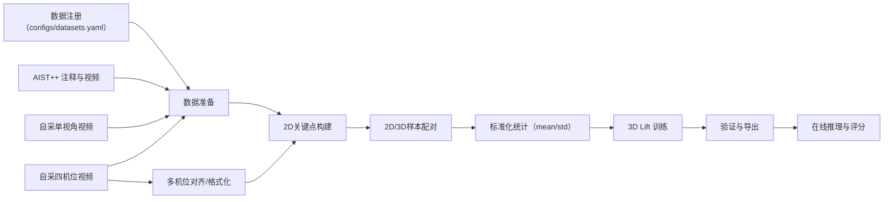
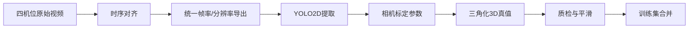

# 训练框架与流程

## 1. 目标与范围

本项目训练链路的目标是：将单摄像头 2D 关键点序列映射为 3D 关节轨迹，并把输出接入动作评分与纠错模块。

当前可用训练主链路基于 AIST++，同时保留自采单视角和自采四机位扩展位。

## 2. 全流程框架



## 3. 训练输入与输出约定

### 3.1 2D 输入文件（`*.npz`）

路径：`data/processed/<dataset>/yolo2d/*.npz`

字段约定：

- `keypoints2d`：`[T, 17, 3]`，最后一维是 `x, y, conf`
- `style`：动作类别或舞种标识（可选）
- 其他字段允许保留，但训练脚本至少需要 `keypoints2d`

### 3.2 3D 标签文件（`*.npz`）

路径：`data/processed/<dataset>/gt3d/*.npz`

字段约定：

- `joints3d`：`[T, 17, 3]`
- 推荐使用与 2D 同名文件，便于自动配对

### 3.3 样本配对规则

实现位置：`src/posementor/data/aist_dataset.py`

- 通过文件名 stem 做 2D/3D 配对
- 两端帧长不一致时按最短长度截断
- 训练/验证按序列名 hash 做稳定划分（默认 `val_ratio=0.1`）
- 序列长度不足最小窗口时自动跳过

## 4. AIST++ 当前训练主链路

### 4.1 数据准备

- 脚本：`download_and_prepare_aist.py`
- 输入：`data/raw/aistpp/annotations`
- 输出：`data/processed/aistpp/gt3d`

### 4.2 2D 构建

两种方式可互换：

1. 使用官方 2D 标注快速构建训练输入  
   脚本：`extract_pose_aist2d.py`
   - AIST++ `keypoints2d` 是 9 机位聚合格式（`cAll`）
   - 训练链路使用单视角输入，默认每条序列选取一个机位
   - 可用 `--camera-index 1` 固定机位，保证全量数据视角一致

2. 从视频跑 YOLO11-Pose 提取 2D  
   脚本：`extract_pose_yolo11.py`

两种方式输出目录一致：`data/processed/aistpp/yolo2d`

### 4.2.1 AIST++ 多机位预览对齐层

AIST++ 的训练输入是单视角，但前端多机位预览需要额外做一次官方时间轴对齐，不能直接把不同机位原视频按同一个帧号硬拼在一起。

当前预览链路会读取：

- `cameras/mapping.txt`
- `cameras/setting*.json`
- `keypoints2d/*.pkl`
- `keypoints3d/*.pkl`

处理方式：

1. 根据 `mapping.txt` 找到当前动作对应的相机方案
2. 读取每个机位的 `K / distortion / rotation / translation`
3. 将官方 3D 关键点重投影回各机位图像平面
4. 与官方 2D 关键点做时间偏移搜索，得到 `camera_offsets`
5. 基于 `camera_trim_start` 重新裁切各机位原视频与 2D 轨迹
6. 输出统一时间轴的 source / 2D / 3D 预览

补充说明见：[`docs/CAMERA_ALIGNMENT.md`](./CAMERA_ALIGNMENT.md)

### 4.3 模型与损失

实现位置：`train_3d_lift_demo.py`

- 模型：`PoseLiftTransformer`（时序 Transformer）
- 输入：`kp2d [B, T, 17, 2]` + `conf [B, T, 17, 1]`
- 输出：`pred3d [B, T, 17, 3]`
- 损失构成：
  - 位置损失：关键点置信度加权 L1
  - 速度损失：相邻帧速度差约束
- 训练框架：PyTorch 2.x + Lightning

### 4.4 评估与导出

- 验证指标：`val_loss`、`val_mpjpe`
- 产物目录：`artifacts/`
- 默认产物：
  - `lift_demo.ckpt`
  - `lift_demo_norm.npz`
  - `visualizations/training_curves.html`
  - `visualizations/training_history.csv`
  - `visualizations/samples/sample_2d_latest.png`
  - `visualizations/samples/sample_3d_latest.html`
- 可选导出：`lift_demo.onnx`

## 5. 训练可视化链路

实现位置：`src/posementor/utils/training_viz.py`

每个 epoch 完成后会更新：

- 曲线页面：loss、MPJPE、学习率
- 样例页面：同一片段的 2D 输入和 3D 预测骨架
- 历史 CSV：便于后续做实验对比、报表和回归检查

## 6. 四机位扩展流程



### 6.1 已实现

- 时序对齐：`prepare_multiview_dataset.py`
- 统一格式导出：`src/posementor/multiview/formatter.py`
- 四机位 2D 递归提取：`extract_pose_yolo11.py --recursive`
- 基于标定参数的 3D 三角化：`triangulate_multiview_dataset.py`
- 报告可视化：`visualize_multiview_report.py`

### 6.2 规划中

- 标定参数求解与版本管理
- 三角化质量自动评分与异常剔除
- UI 侧标定场景选择与结果质检联动

### 6.3 四机位 3D 真值生成设计

当前 `front / left / right / back` 仅是文件组织约定，不代表系统已经具备真实机位几何信息。
要把四路 2D 关键点融合为可训练的 3D 真值，至少需要以下链路：

1. 相机标定：为每台相机求出内参、畸变参数以及相对世界坐标系的外参
2. 时序同步：把四路视频对齐到同一动作时刻
3. 2D 关键点提取：得到每个机位每一帧的人体关键点和置信度
4. 去畸变与投影矩阵构建：将像素点转换到统一成像模型
5. 多视角三角化：由多路 2D 点恢复 3D 点
6. 质量筛选与时序平滑：剔除异常点并输出训练标签

### 6.4 推荐算法

#### 6.4.1 标定

推荐使用棋盘格或 ChArUco 标定板，得到每台相机的：

- 内参矩阵 `K`
- 畸变参数 `distCoeffs`
- 外参旋转 `R`
- 外参平移 `t`

固定场地建议采用“一次标定，多次复用”的方式：只要机位、焦段、分辨率不变，就复用同一套参数。

#### 6.4.2 三角化

工程上建议使用“两阶段”方案：

1. 用线性三角化生成初值
   - 对每个关节、每一帧，收集置信度达标的多个机位 2D 点
   - 使用投影矩阵 `P = K [R | t]` 建立线性方程
   - 通过 DLT 或 `cv2.triangulatePoints` 求出 3D 初值
2. 用重投影误差做优化与筛选
   - 将 3D 点重新投影回各机位图像平面
   - 计算重投影误差
   - 对高误差视角降权或剔除
   - 必要时用最小二乘或 LM 做非线性优化

四机位场景下，这套方法实现难度中等，核心不在数学推导，而在工程细节：同步、标定稳定性、遮挡处理、异常点剔除。

#### 6.4.3 质检与平滑

三角化后的 3D 结果建议增加以下检查：

- 重投影误差阈值
- 单帧最少有效视角数阈值
- 骨长稳定性检查
- 速度/加速度突变检查
- 缺失点插值与时间平滑

### 6.5 真值生成所需最小参数

要完成可用的四机位 3D 真值生成，至少需要：

- 四路视频文件与稳定命名（`front.mp4`、`left.mp4`、`right.mp4`、`back.mp4`）
- 每路视频的帧率、分辨率
- 四路时间偏移量或统一同步事件
- 每台相机的 `K`、`distCoeffs`
- 每台相机的 `R`、`t` 或完整投影矩阵 `P`
- 每帧每机位的 2D 关键点和置信度
- 关键点拓扑定义（17 点骨架）
- 质量控制阈值：最少视角数、最小置信度、最大重投影误差、平滑参数

如果缺少标定参数，系统最多只能完成多机位素材标准化与 2D 提取，不能稳定生成真实 3D 真值。

### 6.6 自采四机位适用边界

自采手机视频可以接入当前前处理链路，但要注意：

- 当前已实现：发现 session、粗对齐、统一格式、递归 2D 提取
- 当前未实现：标定参数管理、三角化、重投影质检、3D 真值导出
- 因此“可直接训练的四机位 3D 真值”仍需补充实现

## 7. 运行清单

训练主链路最短命令：

```bash
uv run python download_and_prepare_aist.py --config configs/data.yaml --download --extract
uv run python extract_pose_aist2d.py --config configs/data.yaml
uv run python train_3d_lift_demo.py --config configs/train.yaml --export-onnx
```

## 8. 当前状态总览

| 模块 | 状态 |
|---|---|
| AIST++ 单视角训练主链路 | 已实现 |
| 训练曲线与样例可视化 | 已实现 |
| 自采四机位对齐与格式化 | 已实现 |
| 自采四机位三角化 3D 真值 | 已实现（基础版） |
| 多数据源统一注册与选择 | 已实现（dataset registry） |
